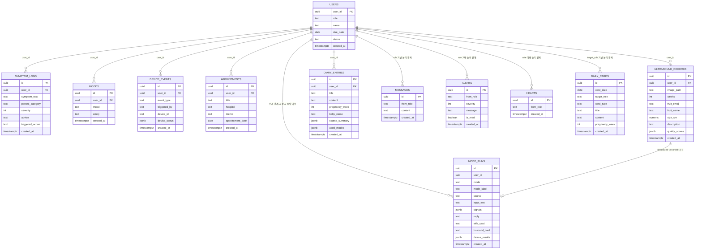
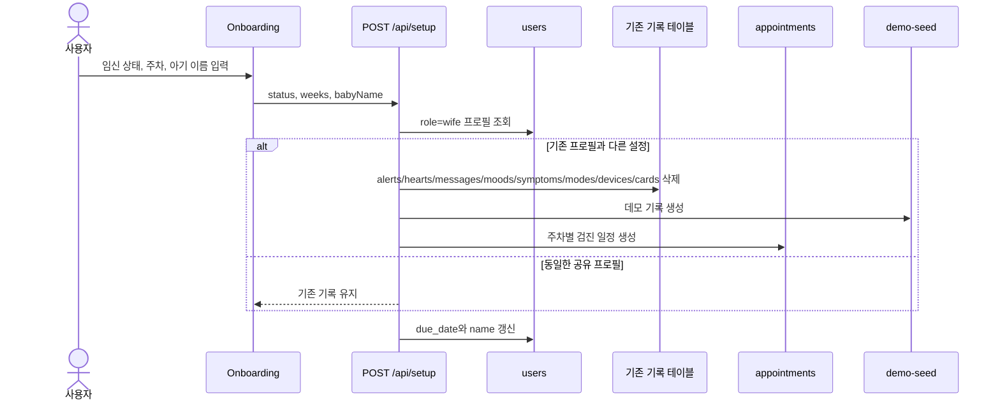
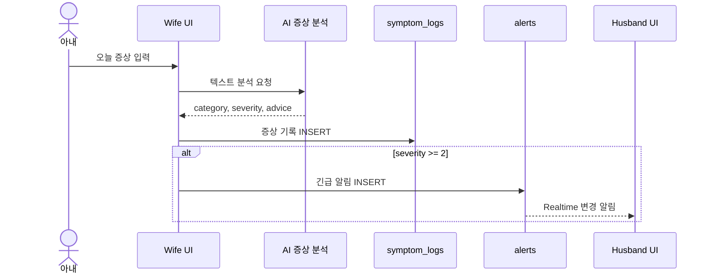
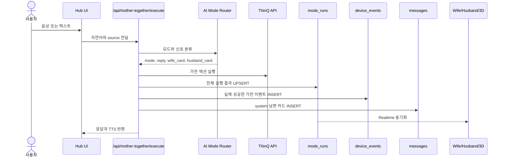
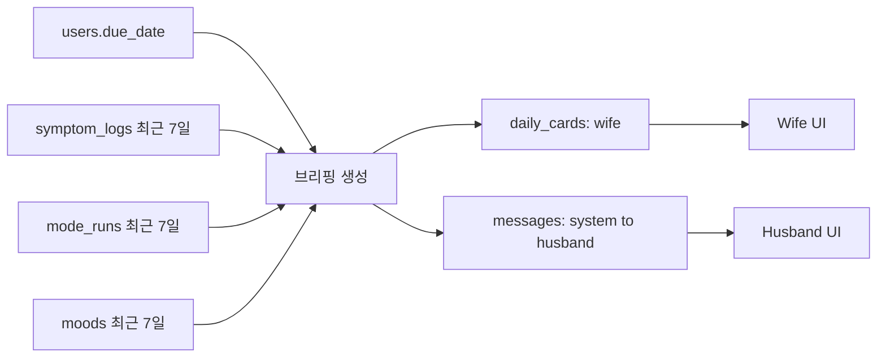
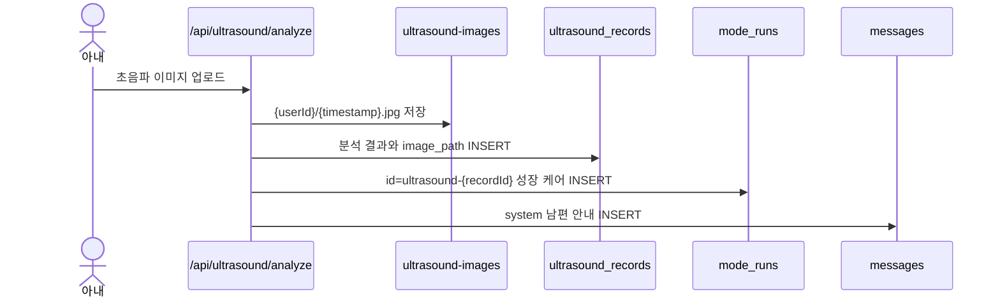
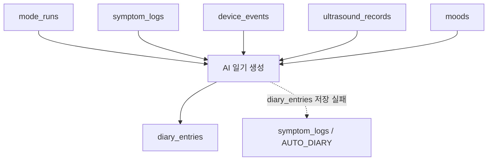

# 데이터베이스 관계 및 흐름

이 문서는 현재 코드가 실제로 읽고 쓰는 Supabase 테이블을 기준으로 작성했다.

> 주의: 현재 `.env.local`의 anon 키로는 Supabase 스키마 메타데이터 조회가
> 차단되어 있다. 아래 `user_id` 관계는 코드와 README에서 확인한 관계이며,
> 실제 DB에 Foreign Key 제약이 설정됐는지는 Supabase Dashboard에서 별도 확인해야 한다.

## 전체 구조 요약

- 사용자 중심 테이블: `users`
- 엄마 상태 기록: `symptom_logs`, `moods`
- 홈케어 실행 기록: `mode_runs`, `device_events`
- 가족 공유: `messages`, `alerts`, `hearts`
- 일정과 콘텐츠: `appointments`, `daily_cards`
- 추억 기록: `ultrasound_records`, `diary_entries`
- 파일 저장소: Storage bucket `ultrasound-images`

현재 코드에서 확인되는 DB 테이블은 총 12개다. README의 기존 "11개 테이블"에서
`diary_entries`가 추가된 상태다.

## 관계도



## 테이블별 역할

| 테이블 | 기준 키 | 생성 주체 | 주요 소비 화면 | 연관 방식 |
|---|---|---|---|---|
| `users` | `user_id`, `role` | 온보딩 | 전체 | 모든 개인 데이터의 기준 |
| `symptom_logs` | `user_id` | 아내 화면, 음성 분석, 일기 fallback | 아내, 남편, 허브, AI API | `users.user_id` |
| `moods` | `user_id` | 아내 화면 | 아내, 남편, 브리핑, 일기 | `users.user_id` |
| `mode_runs` | `id`, 선택적 `user_id` | 허브 AI, 초음파 케어 | 전체, 3D 시뮬레이션 | 시간 및 실행 ID 중심 |
| `device_events` | `user_id` | 모드 실행, 수동 기기 제어 | 전체, 리포트, 일기 | `users.user_id`; `mode_runs`와는 시간/모드로만 연결 |
| `messages` | `from_role` | 아내, 남편, 시스템 | 아내, 남편, 허브 | 사용자 ID 없이 역할로 연결 |
| `alerts` | `from_role` | 심각도 2 이상 증상 저장 | 남편, 허브 | 원본 `symptom_logs` ID 없이 내용으로만 연결 |
| `hearts` | `from_role` | 남편/기능 카드 | 아내, 허브 | 사용자 ID 없이 역할로 연결 |
| `daily_cards` | `card_date`, `target_role` | Cron, 굿모닝 브리핑 | 아내, 남편 | 날짜와 역할로 연결 |
| `appointments` | `user_id` | 온보딩 자동 생성, 아내 입력 | 아내, 남편, 일기 | `users.user_id` |
| `ultrasound_records` | `user_id`, `image_path` | 초음파 분석 API | 아내, 일기 | `users.user_id`, Storage 경로 |
| `diary_entries` | `user_id` | AI 일기 API | 아내 | 여러 원본을 JSON 요약으로 내장 |

## 주요 데이터 흐름

### 1. 온보딩 및 초기화



### 2. 증상 기록과 긴급 알림



현재 `alerts`에는 원본 증상의 `symptom_log_id`가 없다. 따라서 알림에서 정확한
원본 증상 행으로 이동할 수 없고, 메시지/시간으로만 추정할 수 있다.

### 3. 허브 AI 케어 실행



`mode_runs`, `device_events`, `messages`는 한 실행에서 함께 생성되지만 공통
`mode_run_id`가 없다. 현재는 모드와 생성 시각을 이용한 느슨한 관계다.

### 4. 굿모닝 브리핑과 데일리 카드



일반 데일리 카드는 `card_date + target_role`로 upsert한다. 굿모닝 브리핑은
`card_type=MORNING_BRIEFING`으로 insert하므로 중복 생성 정책을 따로 확인해야 한다.

### 5. 초음파 업로드와 성장 케어



Storage 객체와 `ultrasound_records`는 `image_path` 문자열로 연결된다. 성장 케어
`mode_runs`는 FK 대신 `ultrasound-{recordId}` ID 규칙으로 원본을 표현한다.

### 6. AI 일기 생성



`diary_entries.source_summary`와 `used_modes`에는 생성 당시 원본 요약이 저장되지만,
각 원본 행의 ID 목록은 별도 관계 테이블로 관리하지 않는다.

## 화면별 구독 관계

| 화면 | 주요 조회/구독 테이블 |
|---|---|
| Hub | `device_events`, `symptom_logs`, `moods`, `messages`, `alerts`, `hearts`, `mode_runs` |
| Wife | `mode_runs`, `messages`, `hearts`; 필요 시 `daily_cards`, `appointments`, `ultrasound_records`, `diary_entries` 조회 |
| Husband | `device_events`, `symptom_logs`, `moods`, `alerts`, `mode_runs`, `messages`; `daily_cards`, `appointments` 조회 |

Realtime 활성화 대상은 현재 README 기준으로 `device_events`, `mode_runs`,
`messages`, `alerts`, `hearts`, `symptom_logs`, `moods`다.

## 정리 우선순위

1. `mode_runs.user_id`를 필수화하고 모든 저장 경로에서 값을 넣는다.
2. `device_events.mode_run_id`를 추가해 한 AI 실행의 실제 가전 결과를 연결한다.
3. `messages`에 `sender_user_id`, `recipient_role`, `message_type`,
   `mode_run_id`를 추가한다.
4. `alerts`에 `user_id`, `symptom_log_id`를 추가한다.
5. `hearts`에 `sender_user_id`, `recipient_user_id`를 추가한다.
6. `daily_cards`에 `user_id`를 추가하고
   `(user_id, card_date, target_role, card_type)` unique 정책을 둔다.
7. `diary_entries` 저장 실패 시 `symptom_logs`로 대체하는 legacy fallback을 제거한다.
8. `MessageRole` 타입에 실제 저장 값인 `system`을 반영한다.
9. 앱 내부 중복 타입 대신 Supabase 생성 타입을 사용해 컬럼 불일치를 막는다.

## 실제 FK 확인용 SQL

Supabase SQL Editor에서 아래 쿼리를 실행하면 현재 설정된 Foreign Key를 확인할 수 있다.

```sql
select
  tc.table_name,
  kcu.column_name,
  ccu.table_name as referenced_table,
  ccu.column_name as referenced_column,
  tc.constraint_name
from information_schema.table_constraints tc
join information_schema.key_column_usage kcu
  on tc.constraint_name = kcu.constraint_name
  and tc.constraint_schema = kcu.constraint_schema
join information_schema.constraint_column_usage ccu
  on ccu.constraint_name = tc.constraint_name
  and ccu.constraint_schema = tc.constraint_schema
where tc.constraint_type = 'FOREIGN KEY'
  and tc.table_schema = 'public'
order by tc.table_name, kcu.column_name;
```
